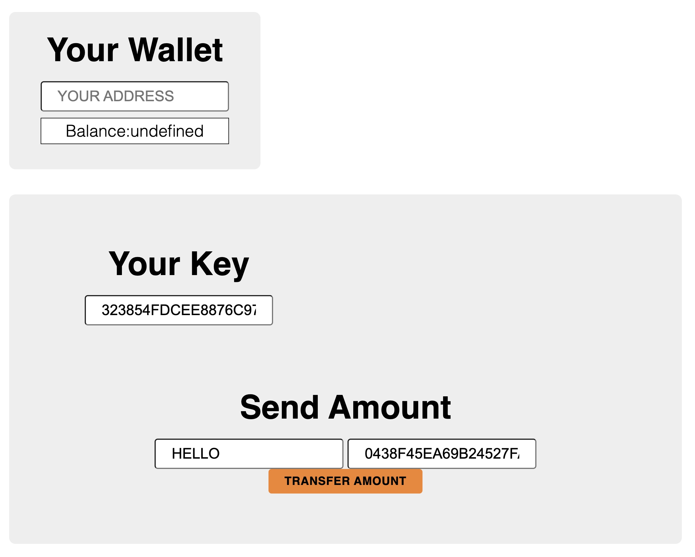
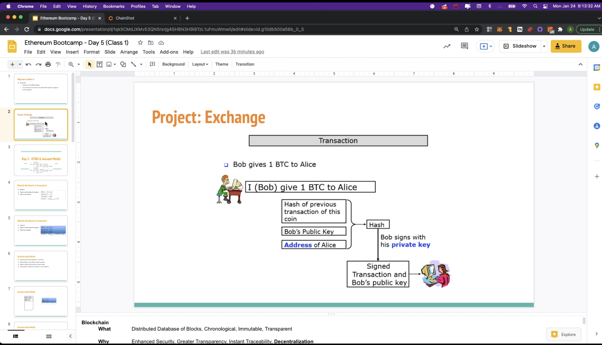

# ECDSA-Exchange
This simple web application takes an array of numbers and then associates them with private and public keys.
Then it allows for exchanging values between the accounts signified by the public and private key pairs.

